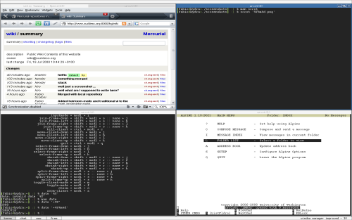

wmi was the initial project which became popular, though [wmii](http://wmii.suckless.org) is the
successor of wmi. The last release of wmi happened back in 2004. There are still
some occasional users of wmi. If you would like to experience the good old days,
please check it out; though, its code sucks more unfortunately than our recent projects.

-><-

Download
--------
* [wmi-11](http://dl.suckless.org/wmi/wmi-11.tar.gz) 2009-11-27 (120kb)

Development
-----------
You can also [browse](http://hg.suckless.org/wmi) its source code repository or
get a copy using [Mercurial](http://www.selenic.com/mercurial/) with the
following command:

	hg clone http://hg.suckless.org/wmi

Build
-----
Read the INSTALL file from the source tarball.

Have fun!
