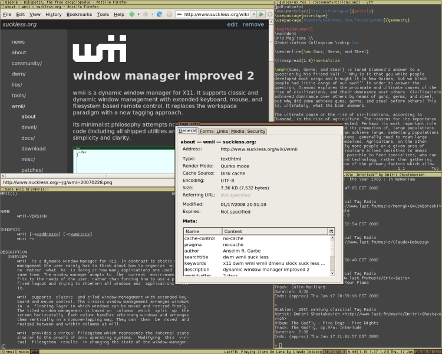

wmii is a small, dynamic window manager for X11. It is scriptable, has a 9p
filesystem interface and supports classic and tiling (acme-like) window
management. It aims to maintain a small and clean (read hackable and beautiful)
codebase.

-><-

Links
-----

* Latest release: [wmii 3.9.2](http://dl.suckless.org/wmii/wmii+ixp-3.9.2.tbz) (recommended)
* Latest devel tip: <code>hg clone [http://hg.suckless.org/wmii](http://hg.suckless.org/wmii)</code>
* Bugs: [Google Code issue tracker](http://code.google.com/p/wmii/issues)
* Mailing List: `dev+subscribe@suckless.org` ([Archives](http://lists.suckless.org/dev/)) ([Old Archives](http://lists.suckless.org/wmii/)) (see [community](http://suckless.org/common/community/) for details)
* IRC channel: [`#suckless`](irc://irc.oftc.net/wmii) at `irc.oftc.net`

Development
-----------
You can [browse](http://hg.suckless.org/wmii) its source code repository or get a copy using [Mercurial](http://www.selenic.com/mercurial/) with following command:

	hg clone http://hg.suckless.org/libixp
	hg clone http://hg.suckless.org/wmii

Older releases
--------------
* [wmii-3.6](http://dl.suckless.org/wmii/wmii-3.6.tar.gz) (historical, 2007-11-16)
* [wmii-3.5.1](http://dl.suckless.org/wmii/wmii-3.5.1.tar.gz) (historical, 2006-12-27)
* [wmii-3.1](http://dl.suckless.org/wmii/wmii-3.1.tar.gz) (historical, 2006-06-17)
* [wmii-2.5.2](http://dl.suckless.org/wmii/wmii-2.5.2.tar.gz) (historical, 2006-01-27)
* [wmii-2](http://dl.suckless.org/wmii/wmii-2.tar.gz) (historical, 2005-10-21)

Make sure that the X Window System headers are installed if you want to build
wmii from source.

Packages
--------
If there are no packages for your Linux distribution/OS yet, ask the
appropriate maintainers to create one or compile wmii from source.

### Debian
Official debian packages are available in the unstable and testing repository
on debian.org. Backports for stable are available on
[backports.org](http://www.backports.org/). Prospective packages and/or
snapshots can be downloaded from the [maintainers
website](http://archive.daniel-baumann.ch/debian/packages/wmii/).
There is also a [user-supplied apt repository at
dpkg.org](http://dpkg.org).

wmii also comes with debian packaging materials. To build a deb, type:

	make deb-dep # Installs any missing build dependencies.
	make deb     # Builds a deb

See also Ubuntu, below.

### Ubuntu
Official ubuntu packages are available in the universe repository. Up-to-date
snapshots are also available in the
[wmii Launchpad PPA](https://launchpad.net/~maglione-k/+archive/ppa). These
packages may also work on debian systems. To build your own deb, see Debian
above.

### Source Mage
A Source Mage spell for the 20070516 wmii snapshot is available. As usual, just
type

`cast wmii`

in a term to install it.

### FreeBSD
Port is available at x11-wm/wmii.

### NetBSD
A pkgsrc package for wmii is available in [wm/wmii](http://pkgsrc.se/wm/wmii) and [wip/wmii-devel](http://pkgsrc.se/wip/wmii-devel).

### OpenBSD
wmii is included in the OpenBSD ports tree ([x11/wmii](http://www.openbsd.org/cgi-bin/cvsweb/ports/x11/wmii/)), and binary packages are available from most [OpenBSD mirrors](http://openbsd.org/ftp.html).

### Arch Linux
* [wmii-3.6](http://archlinux.org/packages/search/?q=wmii) is available in the Arch \[extra\] repository.
* [wmii-hg](http://aur.archlinux.org/packages.php?ID=3497) is available in AUR \[unsupported\]. Building with `makepkg` pulls the latest hg revision.

It is also possible to build an Arch package by simply running `makepkg` from the base of the wmii source tree.

For up-do-date packages, you can add the suckless repo to
`/etc/pacman.conf`:

    [suckless]
    Server = http://dl.suckless.org/arch/x86_64

### Gentoo
Ebuild is available at [x11-wm/wmii](http://packages.gentoo.org/package/x11-wm/wmii).

